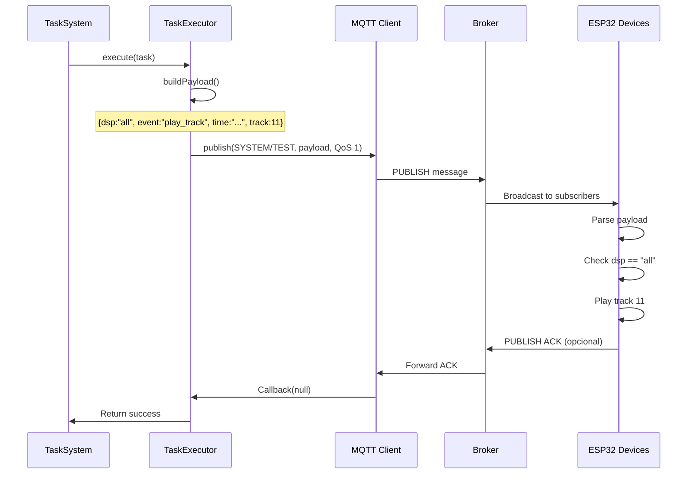

# Protocolo MQTT - Sistema de Tareas Programadas

## 📋 Descripción General

Este documento especifica el protocolo de comunicación MQTT utilizado por el Sistema de Tareas Programadas para enviar comandos broadcast a dispositivos ESP32.

---

## 🔌 Configuración MQTT

### Broker
- **URL:** `mqtt://server-sra.local`
- **Puerto:** 1883 (default MQTT)
- **Protocolo:** MQTT v3.1.1

### QoS (Quality of Service)
- **Nivel:** QoS 1 (At least once)
- **Garantía:** El mensaje llegará al menos una vez
- **Retries:** Automáticos por cliente MQTT

### Retain Flag
- **Valor:** `false`
- **Razón:** Comandos son eventos instantáneos, no estado persistente

---

## 📡 Topic de Publicación

### Topic Principal

```
SYSTEM/TEST
```

**Descripción:**
- Topic especial para comandos de prueba del sistema
- Broadcast a todos los dispositivos ESP32 conectados
- Cada dispositivo decide si procesar el mensaje según `dsp` field

**Suscriptores:**
- Todos los nodos ESP32 del sistema
- Dashboard de monitoreo (opcional)
- Logs del servidor

---

## 📦 Estructura de Mensaje (Payload)

### Formato Base

```json
{
  "dsp": "all",
  "event": "play_track",
  "time": "2025-10-25T20:30:15.234Z",
  "track": 11
}
```

### Campos del Payload

#### `dsp` (String) - **Requerido**
Destinatario del mensaje.

**Valores:**
- `"all"` - Broadcast a todos los dispositivos (valor fijo para Task System)
- `"77FB6C"` - ID específico de dispositivo (no usado en tareas automáticas)

**Descripción:**
- Define qué dispositivos deben procesar el mensaje
- `"all"` → Todos los ESP32 conectados ejecutan el comando
- ID específico → Solo ese dispositivo ejecuta

**Uso en Task System:**
```javascript
// Siempre broadcast
payload.dsp = "all";
```

---

#### `event` (String) - **Requerido**
Tipo de evento/comando a ejecutar.

**Valor fijo:** `"play_track"`

**Descripción:**
- Comando para reproducir pista de audio en dispositivos ESP32
- Interpretado por firmware de dispositivo
- Trigger de reproducción inmediata

**Eventos futuros (no implementados):**
- `"stop_track"` - Detener reproducción
- `"volume_set"` - Ajustar volumen
- `"status_request"` - Solicitar estado

---

#### `time` (String) - **Requerido**
Timestamp de generación del mensaje.

**Formato:** ISO 8601 con milisegundos (UTC)

**Generación:** Automática por TaskExecutor

**Ejemplo:**
```json
"time": "2025-10-25T20:30:15.234Z"
```

**Componentes:**
- `2025-10-25` - Fecha (YYYY-MM-DD)
- `T` - Separador
- `20:30:15.234` - Hora UTC con milisegundos
- `Z` - Indicador UTC

**Uso:**
- Auditoría de comandos
- Prevención de comandos duplicados
- Debugging temporal

---

#### `track` (Number) - **Requerido**
Número de pista de audio a reproducir.

**Rango:** 0-999

**Descripción:**
- Identificador de archivo de audio en memoria del ESP32
- Mapping a archivos físicos (ej: `track_011.mp3`)
- Configurado en firmware de dispositivo

**Tracks comunes:**
```json
"track": 11    // Track de prueba estándar
"track": 15    // Track alternativo
"track": 20    // Track personalizado
```

**Convención recomendada:**
- 11-30: Pruebas automáticas
- 31-50: Pruebas manuales
- 51-100: Alarmas
- 101+: Mensajes personalizados

---

## 📨 Ejemplos de Mensajes

### Ejecución Automática (Tarea Programada)

**Contexto:** Tarea `audio_test_1` se ejecuta automáticamente a las 08:00

**Topic:**
```
SYSTEM/TEST
```

**Payload:**
```json
{
  "dsp": "all",
  "event": "play_track",
  "time": "2025-10-25T08:00:15.234Z",
  "track": 11
}
```

**Logs del servidor:**
```
[TaskScheduler] Ejecutando tarea: audio_test_1 (Prueba Matutina)
[TaskExecutor] Mensaje publicado en SYSTEM/TEST: {"dsp":"all","event":"play_track","time":"2025-10-25T08:00:15.234Z","track":11}
[TaskExecutor] ✓ Tarea ejecutada [SCHEDULED]: { topic: 'SYSTEM/TEST', event: 'play_track', track: 11, time: '2025-10-25T08:00:15.234Z' }
```

---

### Ejecución Manual (Comando Directo)

**Contexto:** Usuario ejecuta tarea manualmente via bot de Telegram

**Topic:**
```
SYSTEM/TEST
```

**Payload:**
```json
{
  "dsp": "all",
  "event": "play_track",
  "time": "2025-10-25T14:35:42.567Z",
  "track": 15
}
```

**Logs del servidor:**
```
[TaskSystem] Ejecutando tarea audio_test_2 manualmente...
[TaskExecutor] Mensaje publicado en SYSTEM/TEST: {"dsp":"all","event":"play_track","time":"2025-10-25T14:35:42.567Z","track":15}
[TaskExecutor] ✓ Tarea ejecutada [MANUAL]: { topic: 'SYSTEM/TEST', event: 'play_track', track: 15, time: '2025-10-25T14:35:42.567Z' }
```

---

### Test Personalizado (Track Libre)

**Contexto:** Test con track específico sin usar tarea configurada

**Topic:**
```
SYSTEM/TEST
```

**Payload:**
```json
{
  "dsp": "all",
  "event": "play_track",
  "time": "2025-10-25T16:20:10.123Z",
  "track": 25
}
```

**Comando:**
```javascript
await taskSystem.executeTestByTrack(25);
```

---

## 🔄 Flujo Completo de Publicación

### Diagrama de Flujo



### Pasos Detallados

#### 1. **Generación del Payload**
```javascript
const payload = {
  dsp: "all",
  event: "play_track",
  time: new Date().toISOString(),
  track: task.action.payload.track
};
```

#### 2. **Serialización JSON**
```javascript
const message = JSON.stringify(payload);
// "{\"dsp\":\"all\",\"event\":\"play_track\",\"time\":\"2025-10-25T08:00:15.234Z\",\"track\":11}"
```

#### 3. **Publicación MQTT**
```javascript
mqttClient.publish(
  'SYSTEM/TEST',    // topic
  message,          // payload (string)
  { qos: 1 },       // options
  (error) => {      // callback
    if (error) {
      console.error('Error publicando:', error);
    } else {
      console.log('Mensaje publicado exitosamente');
    }
  }
);
```

#### 4. **Recepción en ESP32**
```cpp
// Pseudo-código firmware ESP32
void onMqttMessage(String topic, String payload) {
  if (topic == "SYSTEM/TEST") {
    JsonDocument doc;
    deserializeJson(doc, payload);
    
    String dsp = doc["dsp"];
    if (dsp == "all" || dsp == deviceId) {
      String event = doc["event"];
      if (event == "play_track") {
        int track = doc["track"];
        playAudioTrack(track);
      }
    }
  }
}
```

---

## 🛡️ Validaciones y Seguridad

### Validaciones Pre-Publicación

#### 1. **Validación de Cliente MQTT**
```javascript
if (!this.mqttClient || !this.mqttClient.connected) {
  return { 
    success: false, 
    error: 'MQTT_NOT_CONNECTED' 
  };
}
```

#### 2. **Validación de Tarea**
```javascript
if (!task || !task.action || !task.action.payload) {
  return { 
    success: false, 
    error: 'INVALID_TASK' 
  };
}
```

#### 3. **Validación de Track**
```javascript
const track = task.action.payload.track;
if (typeof track !== 'number' || track < 0 || track >= 1000) {
  return { 
    success: false, 
    error: 'INVALID_TRACK' 
  };
}
```

#### 4. **Generación de Timestamp**
```javascript
const timestamp = new Date().toISOString();
// Formato: "2025-10-25T20:30:15.234Z"
```

---

### Manejo de Errores

#### Error de Publicación
```javascript
mqttClient.publish(topic, message, options, (error) => {
  if (error) {
    console.error('[TaskExecutor] Error publicando:', error);
    return { 
      success: false, 
      error: 'MQTT_PUBLISH_ERROR',
      details: error.message
    };
  }
});
```

#### Cliente Desconectado
```javascript
if (!mqttClient.connected) {
  console.error('[TaskExecutor] Cliente MQTT desconectado');
  return { 
    success: false, 
    error: 'MQTT_DISCONNECTED' 
  };
}
```

---

## 📊 Monitoreo y Debugging

### Logs del Sistema

#### Log de Publicación Exitosa
```
[TaskExecutor] Mensaje publicado en SYSTEM/TEST: {"dsp":"all","event":"play_track","time":"2025-10-25T08:00:15.234Z","track":11}
[TaskExecutor] ✓ Tarea ejecutada [SCHEDULED]: { topic: 'SYSTEM/TEST', event: 'play_track', track: 11, time: '2025-10-25T08:00:15.234Z' }
```

#### Log de Error
```
[TaskExecutor] Error publicando mensaje: Error: Client is not connected
```

---

### Herramientas de Debugging

#### 1. **Mosquitto Subscriber (Terminal)**
```bash
# Suscribirse al topic para ver mensajes
mosquitto_sub -h server-sra.local -t "SYSTEM/TEST" -v

# Salida esperada:
# SYSTEM/TEST {"dsp":"all","event":"play_track","time":"2025-10-25T08:00:15.234Z","track":11}
```

#### 2. **MQTT Explorer (GUI)**
- Conectar a broker: `mqtt://server-sra.local`
- Suscribirse a: `SYSTEM/#`
- Ver payloads en tiempo real

#### 3. **Node.js Debug Script**
```javascript
const mqtt = require('mqtt');
const client = mqtt.connect('mqtt://server-sra.local');

client.on('connect', () => {
  console.log('Conectado al broker');
  client.subscribe('SYSTEM/TEST', (err) => {
    if (!err) {
      console.log('Suscrito a SYSTEM/TEST');
    }
  });
});

client.on('message', (topic, message) => {
  console.log(`[${topic}]`, message.toString());
  const payload = JSON.parse(message.toString());
  console.log('Payload:', payload);
});
```

---

## 🔧 Configuración de Dispositivos ESP32

### Suscripción Requerida

Los dispositivos ESP32 deben suscribirse al topic:

```cpp
// Firmware ESP32
void setup() {
  // ... configuración MQTT ...
  
  mqttClient.subscribe("SYSTEM/TEST");
  Serial.println("Suscrito a SYSTEM/TEST");
}
```

### Procesamiento de Mensajes

```cpp
void onMqttMessage(char* topic, byte* payload, unsigned int length) {
  // Convertir payload a string
  String message = "";
  for (int i = 0; i < length; i++) {
    message += (char)payload[i];
  }
  
  // Parsear JSON
  StaticJsonDocument<256> doc;
  DeserializationError error = deserializeJson(doc, message);
  
  if (error) {
    Serial.println("Error parseando JSON");
    return;
  }
  
  // Verificar destinatario
  const char* dsp = doc["dsp"];
  if (strcmp(dsp, "all") == 0 || strcmp(dsp, DEVICE_ID) == 0) {
    
    // Verificar evento
    const char* event = doc["event"];
    if (strcmp(event, "play_track") == 0) {
      
      // Obtener track
      int track = doc["track"];
      
      // Ejecutar comando
      playAudioTrack(track);
      
      // Log
      Serial.printf("Reproduciendo track %d\n", track);
      
      // Opcional: Enviar ACK
      sendAck(track);
    }
  }
}
```

---

## 📈 Rendimiento y Optimización

### Métricas Típicas

| Métrica              | Valor      | Descripción           |
| -------------------- | ---------- | --------------------- |
| Latencia publicación | < 10ms     | Tiempo de `publish()` |
| Latencia broker      | < 50ms     | Tiempo en broker      |
| Latencia total       | < 200ms    | Servidor → ESP32      |
| Throughput           | ~100 msg/s | Máximo recomendado    |
| Payload size         | ~120 bytes | JSON promedio         |

### Optimizaciones

#### 1. **Payload Compacto**
```javascript
// ✅ Recomendado (compacto)
{"dsp":"all","event":"play_track","time":"2025-10-25T08:00:15.234Z","track":11}

// ❌ Evitar (verboso)
{
  "destination": "all",
  "eventType": "play_track",
  "timestamp": "2025-10-25T08:00:15.234Z",
  "audioTrack": 11,
  "metadata": { ... }
}
```

#### 2. **QoS Apropiado**
```javascript
// Comandos de prueba: QoS 1 (recomendado)
{ qos: 1 }  // ✅ Balance entre confiabilidad y rendimiento

// Alternativas:
{ qos: 0 }  // ❌ No confiable (puede perder mensajes)
{ qos: 2 }  // ❌ Sobrecarga (no necesario para comandos)
```

#### 3. **Retain Flag**
```javascript
// Comandos de prueba: Retain = false
{ retain: false }  // ✅ Correcto (eventos instantáneos)

{ retain: true }   // ❌ Incorrecto (causaría reproducción al conectar)
```

---

## 🔍 Troubleshooting MQTT

### Problema: Mensajes no llegan a ESP32

**Diagnóstico:**
```bash
# 1. Verificar broker activo
mosquitto_sub -h server-sra.local -t "#" -v

# 2. Verificar publicación
mosquitto_pub -h server-sra.local -t "SYSTEM/TEST" -m '{"dsp":"all","event":"play_track","time":"2025-10-25T08:00:00Z","track":11}'

# 3. Ver logs del broker
tail -f /var/log/mosquitto/mosquitto.log
```

**Posibles causas:**
1. Broker caído
2. ESP32 no suscrito
3. Credenciales incorrectas
4. Firewall bloqueando puerto 1883

---

### Problema: Payload malformado

**Síntomas:**
- ESP32 no procesa mensaje
- Logs muestran error de parsing JSON

**Validación:**
```javascript
// Validar JSON antes de publicar
try {
  const payload = JSON.stringify(payloadObject);
  JSON.parse(payload); // Validar que es JSON válido
} catch (error) {
  console.error('Payload inválido:', error);
}
```

---

### Problema: Latencia alta

**Diagnóstico:**
```javascript
// Medir latencia de publicación
const startTime = Date.now();
mqttClient.publish(topic, message, options, (error) => {
  const latency = Date.now() - startTime;
  console.log(`Latencia: ${latency}ms`);
});
```

**Soluciones:**
1. Verificar red local (WiFi)
2. Reducir tráfico MQTT
3. Optimizar tamaño de payload
4. Aumentar recursos del broker

---

## 📚 Documentación Relacionada

- **Overview del Sistema:** [TASK-SYSTEM-README.md](./TASK-SYSTEM-README.md)
- **API Completa:** [TASK-API-REFERENCE.md](./TASK-API-REFERENCE.md)
- **Configuración JSON:** [/data/TASK-CONFIGURATION-GUIDE.md](../../data/TASK-CONFIGURATION-GUIDE.md)
- **Guía de Testing:** [TASK-TESTING-GUIDE.md](./TASK-TESTING-GUIDE.md)
- **FAQ:** [/docs/TASK-FAQ.md](../../docs/TASK-FAQ.md)

---

**Versión:** 2.0.0  
**Última actualización:** Octubre 2025  
**Sistema de Monitoreo Local - Nexus Tech**