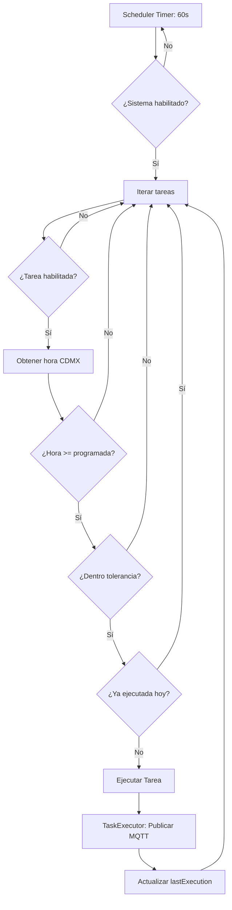
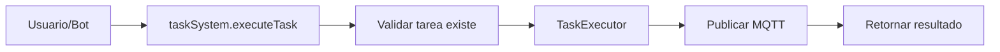

# Sistema de Tareas Programadas - Task System

## 📋 Descripción General

El **Task System** es un módulo de gestión de tareas programadas que permite ejecutar automáticamente comandos MQTT broadcast a dispositivos ESP32 en horarios específicos. Diseñado para el sistema de monitoreo local con soporte completo CRUD (Create, Read, Update, Delete).

### Casos de Uso Principales
- ✅ Pruebas automáticas de audio diarias
- ✅ Verificación de conectividad de dispositivos
- ✅ Ejecución de comandos programados recurrentes
- ✅ Tests manuales bajo demanda

---

## 🏗️ Arquitectura del Sistema

El sistema está compuesto por **4 componentes principales**:

```
┌─────────────────────────────────────────────────────────────┐
│                        TaskSystem                           │
│                  (Orquestador Principal)                    │
│                                                             │
│  • Gestión CRUD de tareas                                  │
│  • Coordinación de componentes                             │
│  • Validaciones de negocio                                 │
│  • Integración con MQTT                                    │
└──────────────┬────────────────┬────────────────┬───────────┘
               │                │                │
       ┌───────▼──────┐  ┌─────▼─────┐  ┌──────▼──────┐
       │ TaskScheduler│  │TaskExecutor│  │TaskConfigMgr│
       └──────────────┘  └───────────┘  └─────────────┘
```

### 1. **TaskSystem** (Singleton)
**Archivo:** `task-system.js`

- Orquestador principal del sistema
- Expone API pública para operaciones CRUD
- Coordina TaskScheduler y TaskExecutor
- Gestiona ciclo de vida del sistema

**Responsabilidades:**
- Crear, leer, actualizar y eliminar tareas
- Validar parámetros de entrada
- Recargar configuración dinámica
- Ejecutar tareas manuales
- Reportar estado del sistema

---

### 2. **TaskScheduler** (Motor de Evaluación)
**Archivo:** `task-scheduler.js`

- Evalúa cada 3 segundos si debe ejecutar tareas
- Calcula hora actual en zona horaria CDMX (UTC-6)
- Aplica tolerancia de 5 minutos por tarea
- Previene ejecuciones duplicadas el mismo día

**Lógica de Evaluación:**
```javascript
// Cada minuto verifica:
1. ¿Hora actual >= hora programada?
2. ¿Diferencia <= tolerancia (5 min)?
3. ¿No se ejecutó hoy?

Si cumple las 3 → Ejecutar tarea
```

**Ejemplo:**
```
Tarea programada: 14:30
Tolerancia: 5 minutos

Ventana de ejecución: 14:30 - 14:35

14:29 → NO ejecutar (aún no llega)
14:30 → SÍ ejecutar (hora exacta)
14:33 → SÍ ejecutar (dentro de tolerancia)
14:35 → SÍ ejecutar (último minuto)
14:36 → NO ejecutar (tolerancia pasada)
14:30 (segunda evaluación) → NO ejecutar (ya ejecutado hoy)
```

---

### 3. **TaskExecutor** (Publicador MQTT)
**Archivo:** `task-executor.js`

- Construye payloads MQTT según especificación
- Publica en topic `SYSTEM/BROADCAST` (broadcast)
- Genera timestamps ISO 8601 (UTC)
- Valida payloads antes de publicar

**Payload MQTT Generado:**
```json
{
  "dsp": "all",
  "event": "play_track",
  "time": "2025-10-25T20:30:15.234Z",
  "track": 11
}
```

---

### 4. **TaskConfigManager** (Persistencia)
**Archivo:** `/data/task-config-manager.js`

- Gestiona lectura/escritura de `task-config.json`
- Operaciones CRUD en archivo de configuración
- Validación de estructura JSON
- Auto-generación de IDs de tareas
- Detección de conflictos de horario

---

## 🚀 Instalación y Configuración

### Requisitos Previos
- Node.js v14+
- Cliente MQTT conectado al broker
- Permisos de lectura/escritura en `/data/`

### Estructura de Archivos
```
/red-local-iot
├── /backend
│   ├── /task-services
│   │   ├── task-system.js
│   │   ├── task-scheduler.js
│   │   ├── task-executor.js
│   │   └── task-test.js
│   └── /mqtt
│       └── index.js (integración)
└── /data
    ├── task-config-manager.js
    └── task-config.json
```

### Integración con Sistema Principal

**1. Importar TaskSystem en `backend/mqtt/index.js`:**
```javascript
const { taskSystem } = require('../task-services/task-system');
```

**2. Inicializar después de conexión MQTT:**
```javascript
mqttClient.on('connect', () => {
  console.log('[MQTT] Conectado al broker');
  
  // Configurar e iniciar TaskSystem
  taskSystem.setMqttClient(mqttClient);
  taskSystem.start();
});
```

**3. Detener limpiamente al cerrar:**
```javascript
mqttClient.on('close', () => {
  console.log('[MQTT] Conexión cerrada');
  if (taskSystem.isRunning) {
    taskSystem.stop();
  }
});
```

---

## 📖 Uso Básico

### Inicialización
```javascript
const { taskSystem } = require('./backend/task-services/task-system');

// Configurar cliente MQTT
taskSystem.setMqttClient(mqttClient);

// Iniciar sistema
await taskSystem.start();
```

### Crear Tarea
```javascript
const result = await taskSystem.createTask(
  "Prueba Mediodía",  // nombre
  12,                  // hora (0-23)
  30,                  // minuto (0-59)
  15,                  // track (0-999)
  true                 // habilitada
);

console.log(result);
// {
//   success: true,
//   taskId: "audio_test_3",
//   task: { ... },
//   message: "Tarea 'Prueba Mediodía' creada exitosamente"
// }
```

### Listar Tareas
```javascript
const tasks = taskSystem.listTasks();

console.log(tasks);
// [
//   {
//     id: "audio_test_1",
//     name: "Prueba Matutina",
//     schedule: { hour: 8, minute: 0 },
//     track: 11,
//     enabled: true,
//     nextExecution: "26/10/2025, 08:00:00"
//   },
//   ...
// ]
```

### Actualizar Tarea
```javascript
const result = await taskSystem.updateTask("audio_test_1", {
  hour: 9,
  minute: 30,
  track: 20,
  enabled: false
});
```

### Eliminar Tarea
```javascript
const result = await taskSystem.deleteTask("audio_test_3");

console.log(result);
// {
//   success: true,
//   message: "Tarea 'Prueba Mediodía' eliminada exitosamente",
//   remainingTasks: 2
// }
```

### Ejecutar Tarea Manual
```javascript
// Ejecutar tarea específica
await taskSystem.executeTask("audio_test_1");

// Ejecutar test con track personalizado
await taskSystem.executeTestByTrack(25);
```

### Obtener Estado del Sistema
```javascript
const status = taskSystem.getStatus();

console.log(status);
// {
//   isRunning: true,
//   taskCount: 2,
//   maxTasks: 10,
//   availableSlots: 8,
//   tasks: [ ... ]
// }
```

---

## 🔧 Configuración

### Archivo: `/data/task-config.json`

```json
{
  "tasks": {
    "audio_test_1": {
      "id": "audio_test_1",
      "name": "Prueba Matutina",
      "enabled": true,
      "schedule": {
        "hour": 8,
        "minute": 0,
        "timezone": "America/Mexico_City"
      },
      "action": {
        "type": "mqtt_broadcast",
        "topic": "SYSTEM/BROADCAST",
        "payload": {
          "event": "play_track",
          "track": 11
        }
      },
      "tolerance_minutes": 5,
      "createdAt": "2025-10-25T20:00:00.000Z",
      "lastExecution": null
    }
  },
  "global_settings": {
    "enabled": true,
    "check_interval_ms": 60000,
    "timezone": "America/Mexico_City",
    "max_tasks": 10,
    "default_track": 11,
    "default_tolerance_minutes": 5
  },
  "metadata": {
    "version": "2.0.0",
    "lastModified": "2025-10-25T21:07:58.200Z",
    "taskCount": 2
  }
}
```

### Parámetros Configurables

| Parámetro           | Descripción          | Valores Válidos       |
| ------------------- | -------------------- | --------------------- |
| `enabled`           | Habilitar tarea      | `true` / `false`      |
| `hour`              | Hora de ejecución    | 0-23                  |
| `minute`            | Minuto de ejecución  | 0-59                  |
| `track`             | Track de audio       | 0-999                 |
| `tolerance_minutes` | Ventana de ejecución | 1-60 (recomendado: 5) |
| `max_tasks`         | Límite de tareas     | 1-10                  |

---

## 📊 Flujo de Ejecución

### Ejecución Automática (Programada)



### Ejecución Manual



---

## 🛡️ Validaciones y Límites

### Límites del Sistema
- **Máximo de tareas:** 10
- **Rango de horas:** 0-23
- **Rango de minutos:** 0-59
- **Rango de tracks:** 0-999
- **Longitud de nombre:** 3-50 caracteres

### Validaciones Automáticas
✅ No permitir nombres duplicados  
✅ No permitir horarios duplicados  
✅ Validar formato de parámetros  
✅ Verificar límite de tareas antes de crear  
✅ Prevenir ejecuciones duplicadas el mismo día  

---

## 🔍 Troubleshooting

### Problema: Tarea no se ejecuta

**Posibles causas:**
1. Sistema globalmente deshabilitado (`global_settings.enabled: false`)
2. Tarea específica deshabilitada (`enabled: false`)
3. Ya se ejecutó hoy (verificar `lastExecution`)
4. Tolerancia expirada (pasaron más de 5 minutos)
5. Cliente MQTT desconectado

**Solución:**
```javascript
// Verificar estado
const status = taskSystem.getStatus();
console.log(status);

// Verificar tarea específica
const task = taskSystem.getTask("audio_test_1");
console.log(task);

// Ver próximas ejecuciones
const nextExec = taskSystem.getNextExecutions();
console.log(nextExec);
```

### Problema: Error al crear tarea

**Posibles causas:**
1. Límite de 10 tareas alcanzado
2. Nombre duplicado
3. Horario duplicado
4. Parámetros inválidos

**Solución:**
```javascript
const result = await taskSystem.createTask(...);
if (!result.success) {
  console.error('Error:', result.error, result.message);
}
```

### Logs Útiles
```bash
# Ver logs del servidor
tail -f /path/to/server.log | grep TaskSystem
tail -f /path/to/server.log | grep TaskScheduler
tail -f /path/to/server.log | grep TaskExecutor
```

---

## 📚 Documentación Adicional

- **API Completa:** [TASK-API-REFERENCE.md](./TASK-API-REFERENCE.md)
- **Configuración JSON:** [/data/TASK-CONFIGURATION-GUIDE.md](../../data/TASK-CONFIGURATION-GUIDE.md)
- **Protocolo MQTT:** [TASK-MQTT-PROTOCOL.md](./TASK-MQTT-PROTOCOL.md)
- **Guía de Testing:** [TASK-TESTING-GUIDE.md](./TASK-TESTING-GUIDE.md)
- **FAQ:** [/docs/TASK-FAQ.md](../../docs/TASK-FAQ.md)

---

## 🔄 Versionado

**Versión Actual:** 2.0.0

### Historial de Cambios

#### v2.0.0 (2025-10-25)
- ✅ Sistema CRUD completo
- ✅ Soporte para múltiples tareas (máx 10)
- ✅ Auto-generación de IDs
- ✅ Validación de conflictos de horario
- ✅ Metadata de configuración
- ✅ Reutilización de IDs eliminados

#### v1.0.0 (2025-10-25)
- ✅ Implementación inicial
- ✅ Scheduler con tolerancia de 5 minutos
- ✅ Integración MQTT broadcast
- ✅ Zona horaria CDMX (UTC-6)

---

## 👨‍💻 Autor

**Sistema de Monitoreo Local**  
Nexus Tech - Cliente SLT  
Versión: 2.0.0  
Fecha: Octubre 2025

---

## 📄 Licencia

Uso interno - Sistema de Monitoreo Local  
© 2025 Nexus Tech